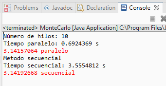

## Metodo Monte Carlo

* Los métodos de Monte Carlo son una amplia clase de algoritmos computacionales que dependen del muestreo aleatorio repetido para obtener resultados numéricos. Uno de los ejemplos básicos para comenzar con el algoritmo de Monte Carlo es la estimación de Pi.

* La idea es simular puntos aleatorios (x, y) en un cuadrado de lado igual a 1 unidad. Imagine un círculo inscrito al cuadrado. Luego calculamos la proporción de puntos que se encuentran dentro del círculo y el número total de puntos generados.

* Se comparo en dos formas, de manera secuencial y de manera paralela.

* Los resultados fueron los siguientes.

* Se muestra una marcada diferencia de tiempo en calcular el PI de manera paralela que de manera secuencial.

* Los archivos JAVA se encuentran dentro del folder **src**

## Metodo de ordenamiento Mergersort
* Merge Sort es un algoritmo Divide and Conquer. Divide el array de entrada en dos mitades, se llama a sí misma para las dos mitades y luego combina las dos mitades ordenadas. La función merge () se usa para fusionar dos mitades. La fusión (arr, left , middle , right) es un proceso clave que supone que arr [left, ... , middle] y arr [middle+1, ..., right] se ordenan y fusiona las dos sub-matrices ordenadas en una. Vea la siguiente implementación de C para más detalles.
